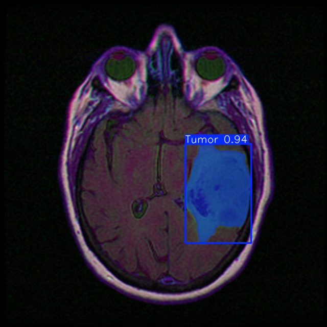

# [PYTHON] YOLO (You Only Look Once)
## How to use my code

With my code, you can:
* **Train your model from scratch**
* **Train your model with my trained model**
* **Evaluate test images with either my trained model or yours**

## Requirements:

* **python**
* **numpy**
* **pandas**
* **glob**
* **opencv (cv2)**
* **tensorboard**
* **shutil**
* **random**

## Datasets:

This dataset contains brain MR images together with manual FLAIR abnormality segmentation masks.
The images were obtained from The Cancer Imaging Archive (TCIA).
They correspond to 110 patients included in The Cancer Genome Atlas (TCGA) lower-grade glioma collection with at least fluid-attenuated inversion recovery (FLAIR) sequence and genomic cluster data available.
* Download the data images and annotations from [kaggle website](https://www.kaggle.com/datasets/mateuszbuda/lgg-mri-segmentation).
* Convert all mask files to polygons using training model :
  ```python
  def mask_to_yolo_polygon(mask_path, output_txt_path, class_id=0):
    # Đọc ảnh mask
    mask = cv2.imread(mask_path, cv2.IMREAD_GRAYSCALE)
    # Lấy kích thước ảnh
    h, w = mask.shape
    # Tìm contours (đường bao)
    contours, _ = cv2.findContours(mask, cv2.RETR_EXTERNAL, cv2.CHAIN_APPROX_SIMPLE)
    with open(output_txt_path, 'w') as f:
        for contour in contours:
            # Lấy các điểm contour
            points = contour.squeeze(axis=1)  # (n, 1, 2) -> (n, 2)
            # Chuẩn hóa tọa độ (0-1)
            normalized_points = [(x / w, y / h) for x, y in points]
            # Tạo chuỗi YOLO Polygon
            yolo_polygon = [class_id] + [coord for point in normalized_points for coord in point]
            yolo_polygon_str = " ".join(map(str, yolo_polygon))
            # Ghi vào tệp .txt
            f.write(yolo_polygon_str + '\n')
    print(f"YOLO Polygon file saved to: {output_txt_path}")
```python
def convert_mask_folder_to_txt(mask_folder, output_folder, class_id=0):
    if not os.path.exists(output_folder):
        os.makedirs(output_folder)

    for mask_file in os.listdir(mask_folder):
        if mask_file.endswith(('.png', '.jpg', '.tif')):
            mask_path = os.path.join(mask_folder, mask_file)
            output_txt_path = os.path.join(output_folder, os.path.splitext(mask_file)[0] + ".txt")
            mask_to_yolo_polygon(mask_path, output_txt_path, class_id)
mask_folder = "/content/drive/MyDrive/YOLOv8/dataset/images_and_labels/masks/val"  # Thư mục chứa ảnh mask
output_folder = "/content/drive/MyDrive/YOLOv8/dataset/images_and_labels/labels/val"  # Thư mục lưu nhãn YOLO Polygon

convert_mask_folder_to_txt(mask_folder, output_folder, class_id=0)
```
## Build Your Own Training Set Configuration and Model Configuration
Model Configuration File:
```yaml
#yolov8x-seg_custom.yaml
# Parameters
# Parameters
nc: 1  # number of classes
depth_multiple: 1.00  # scales module repeats
width_multiple: 1.25  # scales convolution channels

# YOLOv8.0x backbone
backbone:
  # [from, repeats, module, args]
  - [-1, 1, Conv, [64, 3, 2]]  # 0-P1/2
  - [-1, 1, Conv, [128, 3, 2]]  # 1-P2/4
  - [-1, 3, C2f, [128, True]]
  - [-1, 1, Conv, [256, 3, 2]]  # 3-P3/8
  - [-1, 6, C2f, [256, True]]
  - [-1, 1, Conv, [512, 3, 2]]  # 5-P4/16
  - [-1, 6, C2f, [512, True]]
  - [-1, 1, Conv, [512, 3, 2]]  # 7-P5/32
  - [-1, 3, C2f, [512, True]]
  - [-1, 1, SPPF, [512, 5]]  # 9

# YOLOv8.0x head
head:
  - [-1, 1, nn.Upsample, [None, 2, 'nearest']]
  - [[-1, 6], 1, Concat, [1]]  # cat backbone P4
  - [-1, 3, C2f, [512]]  # 13

  - [-1, 1, nn.Upsample, [None, 2, 'nearest']]
  - [[-1, 4], 1, Concat, [1]]  # cat backbone P3
  - [-1, 3, C2f, [256]]  # 17 (P3/8-small)

  - [-1, 1, Conv, [256, 3, 2]]
  - [[-1, 12], 1, Concat, [1]]  # cat head P4
  - [-1, 3, C2f, [512]]  # 20 (P4/16-medium)

  - [-1, 1, Conv, [512, 3, 2]]
  - [[-1, 9], 1, Concat, [1]]  # cat head P5
  - [-1, 3, C2f, [512]]  # 23 (P5/32-large)

  - [[15, 18, 21], 1, Segment, [nc, 32, 256]]  # Detect(P3, P4, P5)
```

```yaml
#custom_data.yaml

path: /content/drive/MyDrive/YOLOv8/dataset/images_and_labels
train: /content/drive/MyDrive/YOLOv8/dataset/images_and_labels/images/train
val: /content/drive/MyDrive/YOLOv8/dataset/images_and_labels/images/val
#test: custom_dataset/test/images
#class
nc: 1
names: ['Tumor']
```
* Make sure to put the files as the following structure:
   ```
  images_and_labels
  ├── images
     │── train
  │   ├── image1.tif
  │   ├── image2.tif
     │── val
  │   ├── image1.tif
  │   └── image2.tif
   
  │── labels
     │── train
  │   ├── image1.txt
  │   ├── image2.txt
     │── val
  │   ├── image1.txt
  │   └── image2.txt
  └── masks
     │── train
      ├── mask1.tif
      ├── mask2.tif
     │── val
      ├── mask1.tif
      └── mask2.tif
  ```
## Training Hyperparameter Configuration File:
We made simple modifications to the training hyperparameters, which can be passed through command-line arguments or configured in a configuration file.
```yaml
task: "detect" # choices=['detect', 'segment', 'classify', 'init'] # init is a special case. Specify task to run.
mode: "train" # choices=['train', 'val', 'predict'] # mode to run task in.

# Train settings -------------------------------------------------------------------------------------------------------
model: yolov8n.pt, custom_data.yaml. Path to model file
data: custom_data.yaml. Path to data file
epochs: 10 # number of epochs to train for
batch: 16 # number of images per batch
imgsz: 640 # size of input images
save: True # save checkpoints
device: '' # cuda device, i.e. 0 or 0,1,2,3 or cpu. Device to run on
project: results_run # project name
name: segment_train # experiment name
# optimizer to use, choices=['SGD', 'Adam', 'AdamW', 'RMSProp']
...
```
## YOLOv8 Segmentation Task Training :
* To install the Ultralytics library for YOLO 
```python
%pip install ultralytics
import ultralytics
ultralytics.checks()
```
* Task Training
```python
from ultralytics import YOLO
#huấn luyện
!yolo task=segment mode=train model= /content/drive/MyDrive/YOLOv8/yolov8n-seg.pt data= /content/drive/MyDrive/YOLOv8/YOLOv8-Image-Segmentation-main/custom_data.yaml epochs=10 batch= 16 project= '/content/drive/MyDrive/YOLOv8/results_run' name='segment_train'
```
* The training/test loss curves for each experiment are shown below:

* Prediction Model

* Task Test
```python
#test
!yolo task=segment mode=predict model=/content/drive/MyDrive/YOLOv8/results_run/segment_train2/weights/best.pt source='/content/drive/MyDrive/YOLOv8/test' save = True project='/content/drive/MyDrive/YOLOv8/result_test' name='yolo_test_result'
```
## Results
|   |    |
| ---------------------------------------- | ------------------------------------------ |
|  |  |
